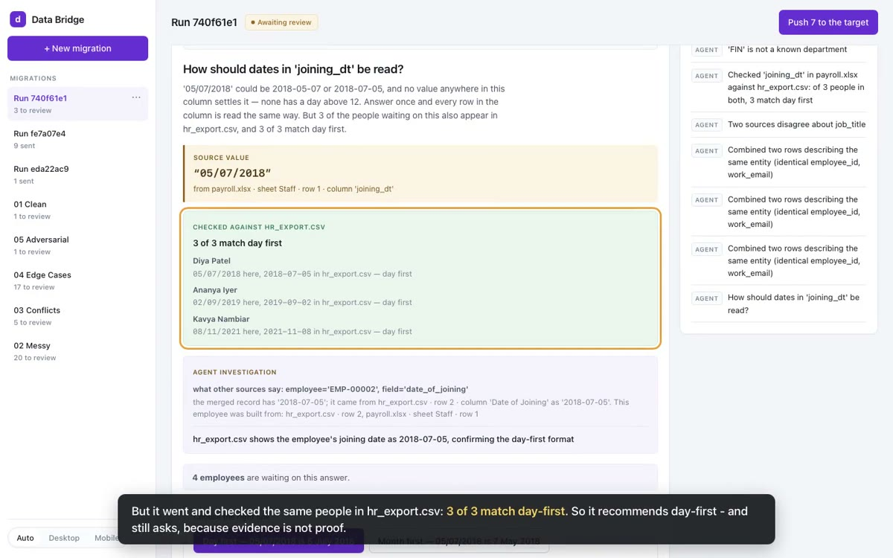
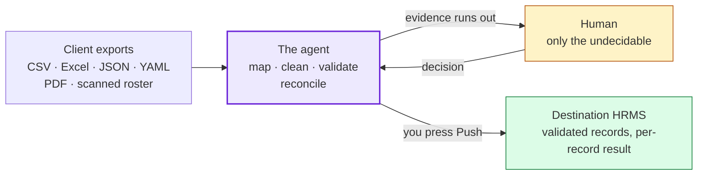
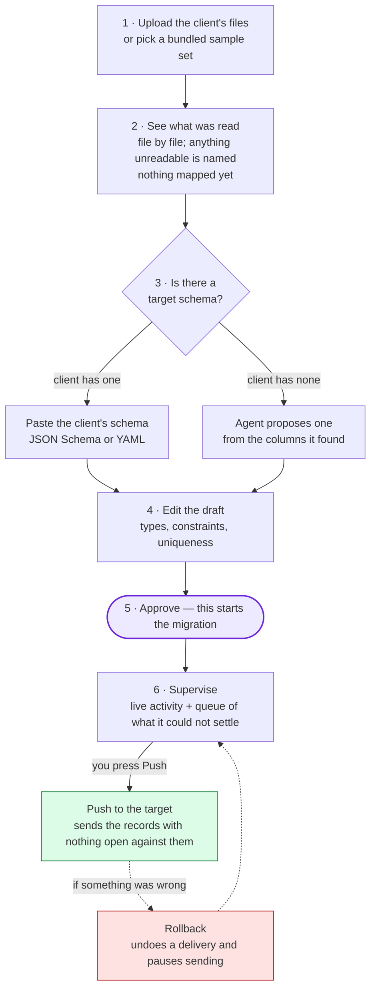
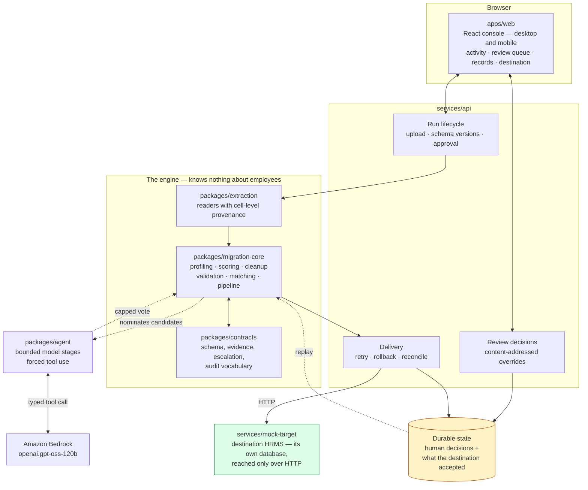
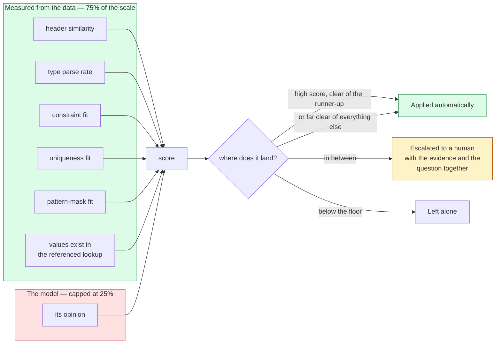

# darwinbox-data-bridge

An agent that migrates a client's messy HR exports into a target schema. It works out
the mapping itself, cleans what it can defend, pushes the result to a destination API,
and stops to ask a human only where the evidence genuinely runs out.

Built for the Darwinbox Forward Deployed Engineer take-home.

### → **Live: http://dbx-console-alb-1789124705.ap-south-1.elb.amazonaws.com**

### → **[Demo recording](docs/demo/data-bridge-demo.mp4)** — 3¾ minutes, captioned, no audio

[](docs/demo/data-bridge-demo.mp4)

The recording runs the demo files against the live console: the agent drafts a schema,
a person edits and approves it, three questions are answered (one by a rule), a push
loses a record and recovers it, and a rollback is undone and resent.

**[One-page write-up](docs/WRITEUP.md)** · **[Why the line is there](docs/calibration.md)** ·
**[Deploying](docs/DEPLOY.md)** · **[Test samples](samples/README.md)** ·
**[How each piece works](docs/FUNCTIONALITY.md)**

---

## In one picture

Seven files in five naming conventions go in. One validated dataset comes out. A
human is asked only about the parts the evidence could not settle.



---

## Product flow

What an operator actually does. Nothing is mapped until a schema is approved — a run
against a schema nobody agreed to makes every decision after it unaccountable.



Constraints you set in step 4 are not decoration — they become evidence the agent
scores against, which means fewer questions in step 6.

---

## Architecture



**The engine is schema-driven.** Nothing in `migration-core` or `agent` knows what an
employee is — `test_no_hardcoded_fields` fails the build if a domain field name ever
appears in either.

**Only two things are durable**: what a human decided, and what the destination
accepted. Everything else is derived by replaying the pipeline over the uploaded files
plus those decisions — so resuming a run and reprocessing after a decision are the same
mechanism, not two code paths that can disagree.

---

## The autonomy boundary

The interesting question is not *can it map columns* but *where does it stop*.



```python
score = 0.75 * deterministic_evidence + 0.25 * model_vote
```

A candidate with no deterministic support **cannot exceed 0.25**, so it can never reach
the auto-apply threshold however certain the model sounds. That is what "a model's
self-reported confidence is not a sufficient basis for the boundary" means in code
rather than in a comment, and `test_model_vote_cannot_decide_alone` asserts it.

Thresholds are **calibrated, not chosen**. `make sweep` reports precision, recall and
error rate across **77 labelled mapping decisions**. At the chosen line, **50 of 57
mappable columns are applied with no human input**, and across every threshold tried
zero mappings are applied wrongly, zero noise columns are mapped, and zero cases
needing a human are silently resolved.

Two obvious ways to push that number higher were measured and **rejected because the
corpus caught them corrupting data**: raising the model's cap maps a noise column, and
letting the model break near-ties maps `dtProbationEnd` onto `date_of_joining` on a
model vote of 1.00. The cap is load-bearing, and there is a measurement that says so.
[The full reasoning](docs/calibration.md).

Escalations are typed — eleven classes, each with its own evidence shape. An ambiguous
column shows both candidates' measurements; an ambiguous date shows both readings it
could be; an uncertain identity shows what agrees and what conflicts.

The line between safe and unsafe cleanup is **reversible and evidence-backed** versus
**inventing data**. Stripping punctuation so a value satisfies a declared pattern is
safe. Adding a `+91` country code so it satisfies that same pattern is not — so the
agent escalates instead.

---

## Run it

Needs Python 3.12 (via [uv](https://docs.astral.sh/uv/)), Node 22 and nothing else —
no database to start, no cloud account.

```bash
uv sync && pnpm install
make run            # builds the UI, starts the destination and the API
```

Open **http://127.0.0.1:8080** and press **New migration**.
Or in containers, the same way a deployment runs it: `make stack`.

```bash
make demo           # run one migration in the terminal
make eval           # measure the escalation boundary against the labelled corpus
make sweep          # show how the boundary moves as thresholds change
make test           # 124 tests, no credentials or network needed
```

The model runs from **recorded replays** committed under `tests/fixtures/model-cache`,
so everything above works offline. Set `OPENAI_API_KEY` and `AWS_REGION` (see
`.env.example`) to call the live model instead.

---

## What the numbers on screen mean

**Rows read** and **employees found** sit side by side because 46 rows becoming 40
people is reconciliation doing its job, not data loss. **Sent to destination** and
**needs review** complete the set. Excluded and destination-refused appear only when
they are not zero.

---

## Tech

Python 3.12 · FastAPI · Pydantic · uv — React 18 · TypeScript · Vite · pnpm —
PyMuPDF + docTR (Apache 2.0) for documents —
`openai.gpt-oss-120b` (Apache 2.0, open weights) on Amazon Bedrock via Converse —
SQLite locally, Postgres via `DATABASE_URL` — ruff, pytest.

**Typed model output uses forced tool use, never `response_format`.** Verified against
gpt-oss-120b: `response_format: json_schema, strict: true` returned reasoning tags, a
markdown preamble and truncated JSON, while `toolChoice` returned pre-parsed,
schema-conformant input.

**Prompt injection** is handled in three layers: source values never enter the system
prompt; output is a typed tool call, so prose has no channel to become an instruction;
and the policy gate discards any proposal naming a column or field outside the
manifest. One fixture cell carries an injection payload.

---

## Deliberately out of scope

Named here because they are real gaps, not oversights.

- **PII handling.** This is HR data — salary, date of birth, national identifiers.
  Production needs field-level sensitivity in the schema, masked display with
  reveal-on-demand, redaction in the audit trail, and a policy on what may reach a
  hosted model. The design has one chokepoint for it: column profiling is the only
  place source values reach the model.
- **Effective-dated records.** An HRMS models employees temporally — transfers,
  promotions, compensation history. This flattens to a current-state snapshot.
- **Destination upsert.** Runs are independent processing scopes; a natural-key
  collision across runs is detected and surfaced rather than silently creating a
  duplicate, but true update semantics need a stable external-ID contract.
- **Durable queue and worker.** Processing is in-process; production wants the job
  graph, leases and dead-letter queues described in `MASTER_PLAN.md`.

---
